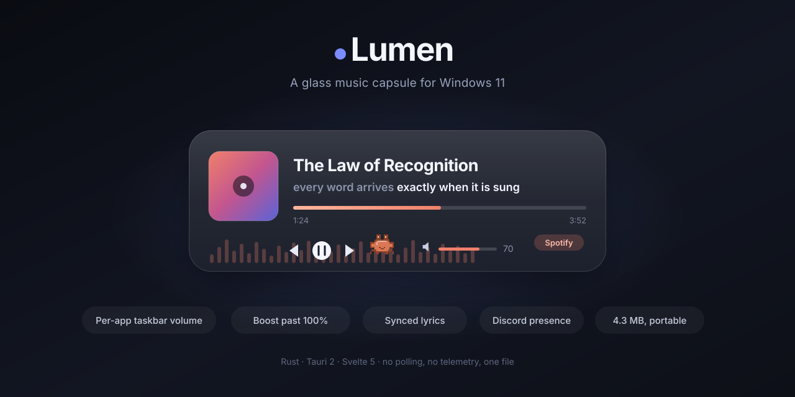
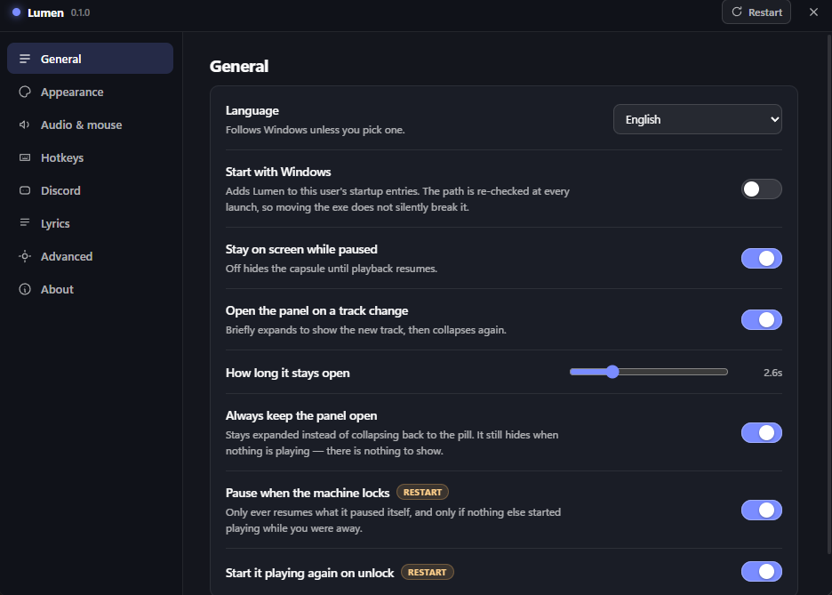

# Lumen

A glass music capsule for Windows 11. It sits above the taskbar, shows what is
playing, and gives the taskbar, the mouse wheel and Discord something useful to
do with it.

[Русская версия](README.ru.md) · [Architecture](ARCHITECTURE.md) · [Download](../../releases/latest)

<p>
  <a href="https://github.com/flexeykinDev/lumen/actions/workflows/ci.yml"></a>
  <a href="https://github.com/flexeykinDev/lumen/releases/latest"></a>
  
  
  
  
  <a href="LICENSE"></a>
</p>



## Features

- **Capsule above the taskbar.** DWM Acrylic/Mica backdrop, expands on hover and
  on track change, drag it anywhere, snaps to corners.
- **Any player.** Reads Windows' own media session (SMTC), so Spotify, browsers,
  foobar2000 and everything else work without integration.
- **Taskbar wheel volume.** Scroll over an app's taskbar button to move *that
  app's* volume. This is the one a stream or a recording can hear — the master
  slider is applied after your audio has already been captured.
- **Volume boost past 100% and bass boost.** Windows caps every volume control at
  unity; Lumen captures the playing app, turns it down to 2%, and renders a
  processed copy in its place. Adds ~30 ms latency while it runs.
- **Close an app from the taskbar.** Middle-click its button.
- **Synced lyrics.** LRCLIB, with a Genius fallback, a karaoke sweep, and a live
  sync slider. Off by default — it is the only feature that uses the network.
- **Spectrum.** 16 log-spaced bands from a WASAPI loopback capture, gated to
  visible-and-playing.
- **Discord Rich Presence.** Real album art, timestamps, link buttons, per-player
  filtering.
- **Smart pause.** Pauses on lock, resumes on unlock — only ever its own pause.
- **Share card.** 1200×600 PNG of the current track, straight to the clipboard.
- **Settings window** in English and Russian, with a first-run tour.
- **An easter egg.** There is a hidden pixel character. No switch reveals him —
  the settings for him do not exist until you have found him. Once he is out: a
  different dance every track, a size, a colour that follows the album art by
  default, accessories, a reaction when you poke him, and he sleeps when the
  music stops.
- **Listening history.** Every play counted locally, with a top 100, top
  artists and totals in the settings window. A track counts after thirty seconds
  — or half its length if shorter — so skipping a playlist does not fill the
  chart with songs you rejected. Nothing is sent anywhere.
- **Above games, or not.** Always on top, only when a game is not filling the
  screen, or never — with a hide/show hotkey either way.
- **OBS output.** Now-playing written to text files, a cover image and a
  ready-made HTML overlay, because window capture of a layered topmost window
  is unreliable by nature.
- **Update check.** One request per launch to a text file in this repository.
  It reports; it never downloads or replaces anything.
- **Portable.** One 4.3 MB exe, one JSON file beside it. No installer, no
  registry beyond an optional autostart entry.

## Tech stack

| Layer | Choice |
|---|---|
| Host | Rust 2024, Tauri 2.11 |
| Renderer | Svelte 5, TypeScript, Vite 8 |
| Windows APIs | windows-rs 0.62 — SMTC, WASAPI, UI Automation, DWM, WH_MOUSE_LL |
| Backdrop | window-vibrancy |
| Hotkeys | global-hotkey |
| Discord | hand-rolled RPC over the named pipe (no crate) |

## Quick start

```bash
npm install
npm run release
```

The portable exe lands at `src-tauri/target/release/lumen.exe`. Copy it
anywhere; it writes `lumen.config.json` next to itself on first run and shows a
short tour.

Development:

```bash
npm run start
```

`npm start` runs Vite and the host together. A bare `cargo build` produces a
standalone binary because `custom-protocol` is a default feature — `npm start`
passes `--no-default-features` so the dev server is used instead.

## Tests

```bash
cd src-tauri && cargo test        # 130 host tests
cargo clippy --all-targets        # clean
npm run check                     # renderer types
npm run check:motion              # host/renderer easing parity
```

Seven tests are `#[ignore]`d because they need real audio playing or a real
lock/unlock:

```bash
cargo test --lib -- --ignored --nocapture the_tap_follows   # capture vs session volume
cargo test --lib -- --ignored --nocapture boost_replaces    # the whole boost chain
cargo test -- --ignored --nocapture spectrum_cost           # spectrum CPU
cargo test -- --ignored genius                              # the Genius scraper still parses
```

## How the boost works

Windows exposes no volume control above 100%: `ISimpleAudioVolume` and
`IAudioEndpointVolume` both take a scalar in `0..=1`. Going louder means
processing the samples.

1. Capture the app's audio with process loopback (`ActivateAudioInterfaceAsync`,
   `PROCESS_LOOPBACK_MODE_INCLUDE_TARGET_PROCESS_TREE`).
2. Turn the app down to 2% — **not** mute. The capture tap sits *after* the
   session volume, so a muted app hands over silence
   (`loopback::tests::the_tap_follows_the_session_volume` measures exactly this;
   the observed ratio is 0.0207).
3. Multiply back by 50, apply gain and a 120 Hz low shelf, then a soft-knee
   limiter so peaks compress instead of clipping.
4. Render to the default endpoint.

What is left of the original plays 34 dB under the boosted copy — inaudible,
where a full-level double would have been an obvious echo. The app's level is
restored when boost stops, when Lumen exits, and on Alt+middle-click.

## Settings



Every option below is in the settings window, in English or Russian, and saves
the moment it changes.

## Configuration

`lumen.config.json`, beside the exe. The listening history is `lumen.stats.json`
in the same folder — plain JSON, yours to read or delete. Falls back to `%APPDATA%\Lumen\` when the
exe directory is read-only; the tray tooltip says which is in use. Everything
below is also in the settings window.

| Key | Values | Notes |
|---|---|---|
| `language` | `auto` \| `en` \| `ru` | `auto` follows the Windows UI language |
| `uiScale` | `0.75`–`2.0` | Interface zoom on top of the monitor's DPI scale |
| `dock` | `taskbar-center` \| `bottom-left` \| `bottom-right` \| `top-left` \| `top-right` \| `free` | |
| `backdrop` | `auto` \| `acrylic` \| `mica` | Applied at launch |
| `shape` | `round` \| `square` | |
| `monitor` | `primary` \| `cursor` | |
| `alwaysExpanded` | bool | Hold the panel open instead of collapsing |
| `showWhilePaused` | bool | |
| `autoExpandOnTrackChange`, `autoExpandMs` | bool, ms | |
| `volumeStep` | `0.01`–`0.1` | Per wheel notch |
| `boost.enabled`, `boost.gain`, `boost.bassDb` | bool, `0.5`–`3.0`, `-12`–`12` | See above |
| `mouse.taskbarWheelVolume` | bool | Wheel over the taskbar changes volume |
| `mouse.taskbarWheelPerApp` | bool | Over a button, that app; over empty bar, the master |
| `mouse.taskbarWheelOverFullscreen` | bool | Keeps working where the bar would be under a game |
| `mouse.taskbarCloseButton` | `middle` \| `right` \| `none` | `right` replaces the jump list |
| `mouse.middleClickHides`, `mouse.altMiddleQuits` | bool | On the capsule itself |
| `lyrics.enabled`, `lyrics.geniusFallback` | bool | Network |
| `lyrics.offsetMs` | ±3000 | Shifts every line, live |
| `lyrics.estimatedOffsetMs` | ±5000 | Guessed timings only |
| `discord.enabled`, `discord.applicationId` | bool, string | See below |
| `discord.activity` | `listening` \| `playing` | Progress bar *or* buttons — Discord draws buttons on Playing only |
| `discord.albumArt` | bool | Looks the cover up on the iTunes Search endpoint |
| `discord.hiddenSources` | string[] | Players never published |
| `smartPause.enabled`, `smartPause.resumeOnUnlock` | bool | |
| `spectrum.enabled` | bool | |
| `pet.*` | — | Written by the easter egg. Nothing to set by hand |
| `updates.check` | bool | Ask GitHub whether a newer release exists, once per launch |
| `onTop` | `always` \| `games` \| `never` | `games` stands down while a full-screen game owns the foreground |
| `appearance.surface` | `system` \| `solid` \| `clear` | `clear` removes the panel entirely |
| `appearance.opacity` | `0`–`1` | Panel only; the contents stay readable |
| `appearance.tint`, `appearance.ink` | `#rrggbb` \| `auto` | `auto` follows the album art |
| `appearance.radius` | px | Corner radius. On Windows 10 this is what shapes the capsule |
| `obs.enabled`, `obs.folder`, `obs.writeCover` | bool, path, bool | Now-playing files for OBS |
| `startWithWindows` | bool | Mirrored into `HKCU\…\Run`, reconciled every launch |

### Hotkeys

Defaults are F5/F6/F7 laid out left-to-right, matching the on-screen buttons.
Everything else is unbound — a default is a key taken away from something the
user may already have bound.

| Key | Action | Default |
|---|---|---|
| `hotkeys.previous` | Previous track | `F5` |
| `hotkeys.playPause` | Play / pause | `F6` |
| `hotkeys.next` | Next track | `F7` |
| `hotkeys.cycleSession` | Follow the next playing app | `Ctrl+F6` |
| `hotkeys.volumeUp` / `volumeDown` | The playing app's own volume | — |
| `hotkeys.repeat` | Cycle the player's repeat mode | — |
| `hotkeys.toggleVisible` | Hide or show the capsule | — |
| `hotkeys.togglePinned` | Keep the panel open | — |

Accepts `Ctrl+KeyA` and `ctrl+a` shorthand. A binding another app already owns
is logged and skipped; the rest still work.

### Discord

Works out of the box: presence is published as Lumen's own Discord application,
so a fresh install shows "Listening to Lumen" with the cover, the timestamps and
the buttons, with nothing to configure.

To publish under your own name instead, create an application at
<https://discord.com/developers/applications> — its name is what renders after
"Listening to" — and paste its id into settings → Discord. Upload an image named
`lumen` under Rich Presence → Art Assets for the fallback artwork and the small
badge.

Buttons never render on your own profile — only other people see them — and
Discord draws them only for a *Playing* activity. `discord.activity` is the
choice between the progress bar and the buttons.

## Mouse gestures

| Gesture | Action |
|---|---|
| Wheel over the taskbar | Volume, per app |
| Wheel over the capsule | Volume of the playing app |
| Middle-click a taskbar button | Close that app |
| Middle-click the capsule | Hide it until the next track |
| Alt + middle-click the capsule | Kill this instance immediately |
| Ctrl + wheel | Big volume steps (5×) |
| Shift + wheel | Fine volume steps (¼×) |
| Click the volume bar | Explains the wheel and its modifiers — the bar itself is a readout |
| Drag the capsule | Move it; near a corner it snaps |

Alt+middle-click exits by the shortest path and writes nothing on the way out.
It still restores the volume of any app boost had turned down.

## Known costs

Measured on the development machine, not estimated:

| | |
|---|---|
| Portable exe | 4.31 MB |
| CPU, nothing playing | 0.00% — no polling anywhere; SMTC, the mouse hook and lock/unlock are all event-driven |
| CPU, playing, capsule collapsed | ~0.5% of one core — one SMTC timeline event per second, and the clock it drives |
| CPU, spectrum visible | +0.043% of the machine (0.52% of one core) |
| CPU, boost running | one capture and one render thread at 48 kHz |
| RAM, host process | 33 MB working set, 7 MB private |
| RAM, with WebView2 | ~200 MB private, 405–476 MB working set across the process tree |

The memory figure is WebView2's floor, not Lumen's data — two WebViews (capsule
and settings) with the browser process tree behind them. The original brief
asked for under 20 MB; that is not reachable with a WebView-based renderer, and
`ARCHITECTURE.md` §3 covers what was tried.

## Requirements

- Windows 10 1809 or newer. What differs by version is answered at runtime and
  reported in About:

  | | Windows 10 | Windows 11 22H2+ |
  |---|---|---|
  | Acrylic | legacy `SetWindowCompositionAttribute` | DWM `DWMSBT_TRANSIENTWINDOW` |
  | Mica | not available, falls back to Acrylic | yes |
  | Rounded corners | drawn by Lumen (`appearance.radius`) | DWM rounds the window |
  | Volume boost | 2004 (19041) and newer | yes |
- WebView2 runtime — preinstalled on Windows 11.
- To build: Rust 1.85+, Node 20+, MSVC toolchain.

## License

[MIT](LICENSE).
